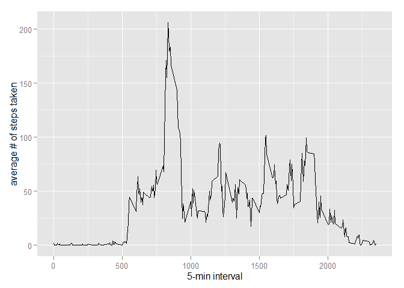

# Reproducible Research: Peer Assessment 1

Comments: 
This assigment is created and tested on Windows 7 with R Studio
Please note that this program was run on a Dutch Windows version
Which resulted in a solution with dutch Day Notations
The requirements and comments for Peer Assessment 1 are in the headings of the code segments underneeth. 

## Loading and preprocessing the data
Requirements:</br>
Show any code that is needed to:</br>
1.1. Load the data (i.e. read.csv())</br>
1.2. Process/transform the data (if necessary) into a format suitable for your analysis</br>
Comments:
unzip file manually and then read in the csv file

```r
activtyData <- read.csv("./activity/activity.csv")
```

## What is mean total number of steps taken per day?
Requirments:</br>
For this part of the assignment, you can ignore the missing values in the dataset.</br>
2.1. Calculate the total number of steps taken per day</br>
2.2. If you do not understand the difference between a histogram and a barplot, research the difference between them. Make a histogram of the total number of steps taken each day</br>
2.3. Calculate and report the mean and median of the total number of steps taken per day</br>


```r
library(ggplot2)
```

```
## Warning: package 'ggplot2' was built under R version 3.1.3
```

```r
#Requirement 2.1
totalSteps <- tapply(activtyData$steps, activtyData$date, FUN=sum, na.rm=TRUE)
#Requirement 2.2
qplot(totalSteps, binwidth=1000, xlab="# steps taken each day")
```

 

```r
#Requirement 2.3 mean
mean(totalSteps, na.rm=TRUE)
```

```
## [1] 9354.23
```

```r
#Requirement 2.3 median
median(totalSteps, na.rm=TRUE)
```

```
## [1] 10395
```

## What is the average daily activity pattern?
Requirements:</br>
3.1 Make a time series plot (i.e. type = "l") of the 5-minute interval (x-axis) and the average number of steps taken, averaged across all days (y-axis) </br>
3.2 Which 5-minute interval, on average across all the days in the dataset, contains the maximum number of steps? </br>


```r
#Requirement 3.1
average<- aggregate(x=list(steps=activtyData$steps), by=list(interval=activtyData$interval),
                      FUN=mean, na.rm=TRUE)
ggplot(data=average, aes(x=interval, y=steps)) +  geom_line() +xlab("5-min interval") + ylab("average # of steps taken")
```

 

```r
#Requirement 3.2
average[which.max(average$steps),]
```

```
##     interval    steps
## 104      835 206.1698
```


## Imputing missing values
Requirements:<br>
4.1 Calculate and report the total number of missing values in the dataset (i.e. the total number of rows with NAs)<br>
4.2 Devise a strategy for filling in all of the missing values in the dataset. The strategy does not need to be sophisticated. For example, you could use the mean/median for that day, or the mean for that 5-minute interval, etc.<br>
4.3 Create a new dataset that is equal to the original dataset but with the missing data filled in.<br>
4.4 Make a histogram of the total number of steps taken each day and Calculate and report the mean and median total number of steps taken per day. Do these values differ from the estimates from the first part of the assignment? What is the impact of imputing missing data on the estimates of the total daily number of steps?<br>
Comment: Requirement 4.4 is a comparison between the total steps calculated earlier. <br>
When comparing the resuls it becomes clear that after imputing the missing dada that there the mean and median become higher.


```r
#Requirement 4.1 
missingValues<-sum(is.na(activtyData$steps))
print(missingValues)
```

```
## [1] 2304
```

```r
# Requirement 4.2
fill <- function(steps, interval) {if (!is.na(steps)) return(steps) else return (average[average$interval==interval, "steps"])}
#Requirement 4.3 
newactivtyData <- activtyData
newactivtyData$steps <- mapply(fill, newactivtyData$steps, newactivtyData$interval)
totalSteps2 <- tapply(newactivtyData$steps, newactivtyData$date, FUN=sum)
qplot(totalSteps2, binwidth=1000, xlab="total # of steps taken each day")
```

 

```r
#Requirement 4.4
mean(totalSteps2)
```

```
## [1] 10766.19
```

```r
#Requirement 4.4
median(totalSteps2)
```

```
## [1] 10766.19
```

## Are there differences in activity patterns between weekdays and weekends?
Requirements:<br>
5.1. Create a new factor variable in the dataset with two levels – “weekday” and “weekend” indicating whether a given date is a weekday or weekend day.<br>
5.2 Make a panel plot containing a time series plot (i.e. type = "l") of the 5-minute interval (x-axis) and the average number of steps taken, averaged across all weekday days or weekend days (y-axis). See the README file in the GitHub repository to see an example of what this plot should look like using simulated data.<br>


```r
# Requirement 5.1
IsDutchWeekend <- function(date) {
  #Dutch dates Dutch day notations for Sat, Sun .... etc...
  day <- weekdays(date)
  if (day %in% c("maandag", "dinsdag", "woensdag", "donderdag", "vrijdag")) return("weekday")
  else if (day %in% c("zaterdag", "zondag")) return("weekend")
  else stop("Error in Weekend function")
}
newactivtyData$date <- as.Date(newactivtyData$date)
newactivtyData$isWeekend <-  sapply(newactivtyData$date, FUN=IsDutchWeekend)
newactivtyData$week <- as.factor(newactivtyData$isWeekend)
#Requirement 5.2
averages <- aggregate(steps ~ interval+week, data=newactivtyData, mean)
ggplot(averages, aes(interval, steps)) + geom_line() + facet_grid(week ~ .) + xlab("5-minute interval") + ylab("# of steps")
```

 


